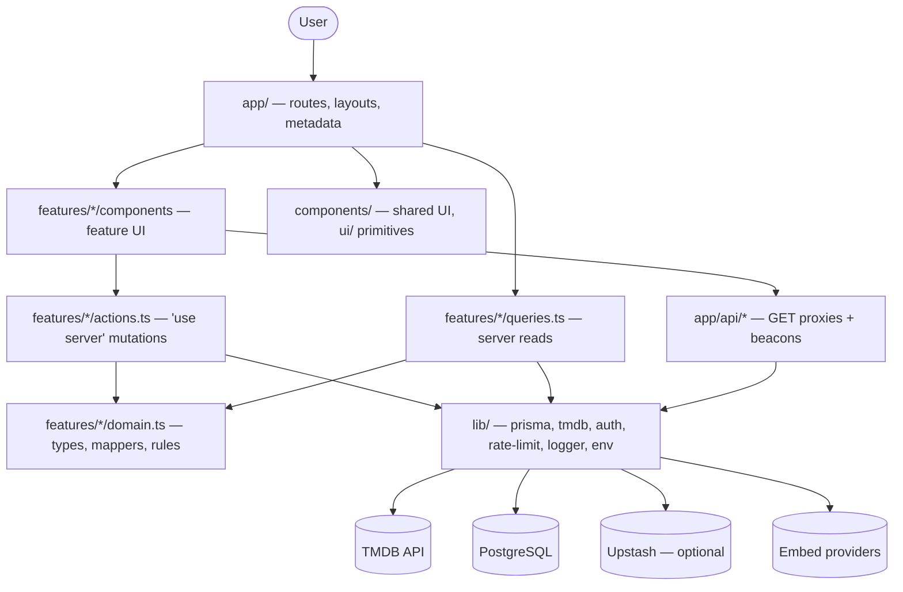

# Streamly — Architecture

Next.js 16 (App Router) streaming catalog. TMDB supplies metadata, six
third-party providers supply playback via iframe, PostgreSQL (Prisma)
stores users, favorites, watch history, comments and admin-curated
featured titles.

This document describes how the app is put together and, where it
matters, why. For setup and environment variables see [README.md](./README.md).

---

## 1. Layering



Each layer may only reach downward:

| Layer | Location | Responsibility | Must not |
|---|---|---|---|
| Presentation | `app/`, `features/*/components`, `components/` | Render, capture input | Query the DB, call TMDB, hold business rules |
| Application | `features/*/actions.ts`, `features/*/queries.ts`, `app/api/` | Auth, validation, rate limiting, orchestration | Contain rendering |
| Domain | `features/*/domain.ts` | Types, mappers, business rules | Know about HTTP, React or Prisma |
| Infrastructure | `lib/` | Clients, config, cross-cutting concerns | Contain feature logic |

## 2. Folder structure

```
src/
├── app/                    # routes only — thin, delegate to features/
│   ├── [type]/[id]/        # title details (movie|tv)
│   ├── [type]/genre/[id]/  # browse by genre
│   ├── movies/ tv/         # both delegate to features/catalog BrowsePage
│   ├── search/ watch/ favorites/ history/ admin/
│   └── api/                # only what must stay HTTP — see §5
├── features/
│   ├── catalog/            # browse, details, cards, hero
│   │   ├── components/
│   │   ├── domain.ts       # MediaSummary, MediaDetails + mappers
│   │   └── domain.test.ts
│   ├── watch/ favorites/ history/ comments/ admin/ search/
│   │   ├── components/
│   │   ├── actions.ts      # "use server" mutations
│   │   └── queries.ts      # server-side reads
├── components/             # shared across features
│   └── ui/                 # MediaGrid, PosterImage
├── lib/                    # infrastructure + cross-cutting
└── types/
```

A component belongs in `components/` only when more than one feature
uses it. Everything else lives with its feature.

## 3. Data flow

**Reading a title** — one server render, no client fetch:

```
/movie/603
  └─ app/[type]/[id]/page.tsx        validates params, 404s on bad input
       ├─ getDetails()               lib/tmdb.ts, fetch cached 1h
       └─ getComments()              features/comments/queries.ts (Prisma)
            ↓ Promise.all — independent, so concurrent
       mapMediaDetails()             features/catalog/domain.ts
            ↓ MediaDetails (resolved, camelCase, URLs built)
       React Server Components → HTML
```

**Mutating** — Server Action, no client fetch, no API route:

```
FavoriteButton (client)
  └─ addFavorite(input)              features/favorites/actions.ts
       ├─ requireUserAction(limiter) auth + rate limit
       ├─ parseInput(schema)         Zod
       ├─ prisma.favorite.upsert()
       └─ revalidatePath("/favorites")
            ↓ ActionResult<T> — { ok } or { ok: false, error }
       component branches on the result
```

**Watching** — stream URLs are built server-side and never depend on
client input:

```
/watch/movie/603
  └─ app/watch/[type]/[id]/page.tsx
       ├─ resolveResumePoint()       session + WatchHistory (indexed)
       ├─ getServerLang()            subtitle language
       └─ getBasicDetails()          ↓ all three via Promise.all
       getServers()                  lib/vidsrc.ts — pure URL builder
            ↓ StreamServer[]
       Player (client) → <iframe src=…>
            └─ postMessage progress → POST /api/history (throttled)
```

## 4. Domain model

`lib/tmdb-shared.ts` holds TMDB's wire format — snake_case, `title` OR
`name`, `poster_path` as a bare path, `media_type` sometimes absent.
That shape stops at `features/catalog/domain.ts`.

Above the mapper the app speaks `MediaSummary` / `MediaDetails`:
resolved title, four-digit `year`, `rating` that is `null` (not `0`)
when TMDB has no votes, and image URLs already built. No component
imports a `Tmdb*` type.

## 5. API routes vs Server Actions

Mutations are Server Actions. An API route exists only where HTTP
semantics are genuinely required:

| Route | Why it stays HTTP |
|---|---|
| `api/auth/[...nextauth]` | Auth.js owns the endpoint |
| `api/history` | The player's progress beacon needs `keepalive` on `pagehide`, which Server Actions don't expose |
| `api/season` | Fetched on demand as the user switches seasons |
| `api/trailer` | Fetched lazily on card hover |
| `api/locale` | Sets a cookie and returns |
| `api/register` | Public, pre-authentication |

Both paths share the same guards: `requireUserApi` / `requireUserAction`
wrap auth + rate limiting, `admin-guard.ts` adds the role check, and both
validate with the Zod schemas in `lib/api-schemas.ts`.

## 6. Authentication & authorization

Auth.js v5 with the Prisma adapter but a **JWT session strategy** — there
is no `Session` table. Google OAuth is registered only when both
credentials are set; Credentials login is bcrypt with an IP rate limit.

Roles live on the JWT and are re-read from the database whenever the
token is older than 60s, so bans and role changes take effect within that
window instead of at token expiry.

**Admin promotion via `ADMIN_EMAILS` fires only on an OAuth sign-in with
a verified email.** `/api/register` is unauthenticated and unverified, so
promoting on the credentials path would let anyone pre-register an
admin's email and inherit ADMIN. Consequence: a credentials-only
deployment cannot bootstrap an admin this way — hence the last-admin
guard, which refuses to demote, ban or delete the final active admin.

Admin routes are gated in `app/admin/layout.tsx` (which every admin page
inherits) and again inside every admin action. The layout guard is not
the only line of defence by design.

## 7. Caching

Two independent layers, and only one of them is doing work:

- **Fetch layer (active).** Every TMDB call goes through `tmdb()` with
  `next: { revalidate }`, default 1h. This is what keeps TMDB from being
  hit per visitor.
- **Page layer (mostly inactive).** Catalog pages read `searchParams`
  and every TMDB helper reads the `lang` cookie via `getServerLang()`,
  both of which force dynamic rendering. Page-level `revalidate` exports
  were therefore inert and have been removed rather than left as
  misleading documentation. The build's route table is the source of
  truth: `ƒ` is dynamic, `○` is prerendered.

`/api/trending-searches` was the one genuinely prerendered route, with
the caveat that a prerender has no cookie and so always used the default
locale. It has since been removed along with `/api/search`, as the
server-rendered search page made both unnecessary.

Mutations invalidate with `revalidatePath` from inside the action.

## 8. Streaming providers

`lib/vidsrc.ts` is a registry of provider URL builders and the **single
source of truth for the CSP**: `next.config.ts` imports
`PROVIDER_FRAME_HOSTS` and joins it into `frame-src`, so adding a
provider updates the policy automatically. A unit test asserts every
generated URL's origin appears in that list.

The player iframe has **no `sandbox` attribute** — the providers break
under a unique-origin sandbox. `referrerPolicy="no-referrer"` limits what
leaks. This is the largest residual security surface in the app and is a
deliberate, documented trade-off.

Progress events arrive via `postMessage`. The listener **validates
`event.origin` against the active provider's origin** before accepting
anything, since the iframe is third-party and unsandboxed. Payload shapes
differ per provider and are read defensively.

## 9. Error handling

| Layer | Strategy |
|---|---|
| Server Actions | Return `ActionResult` — never throw across the RSC boundary, which would surface as a redacted generic error |
| API routes | One `{ error }` JSON shape via `apiError()`; malformed bodies are 400, not 500 |
| TMDB | `TmdbError` with an 8s `AbortSignal.timeout`; the home page degrades rail-by-rail rather than 500ing |
| Prisma | `P2025` (not found) treated as success for deletes — idempotent, and avoids an existence oracle |
| UI | Route-level `error.tsx` / `not-found.tsx`; components surface action errors inline via `role="alert"` |

Logging goes through `lib/logger.ts`: JSON lines in production, readable
in development, stack traces stripped in production (they leak absolute
paths and query fragments), and Prisma error codes preserved.

## 10. Security

- CSP, HSTS, `frame-ancestors 'none'`, `X-Frame-Options`, nosniff,
  Referrer-Policy and Permissions-Policy in `next.config.ts`.
- `src/proxy.ts` (Next 16's replacement for `middleware.ts`) enforces an
  Origin/Host match on every non-GET API request as CSRF defence in depth
  on top of the `sameSite=lax` cookie, and stamps `no-store` on
  user-scoped responses.
- All input validated with Zod at the boundary. `posterPath` is regex-
  checked because it is interpolated into an image URL; titles are bounded.
- `getClientIp` reads the **rightmost** `X-Forwarded-For` entry — the
  leftmost is client-controlled and would let a caller forge a fresh
  rate-limit bucket per request. Unit-tested.
- The service worker never caches HTML for `/admin`, `/favorites`,
  `/history` or `/sign-in`; those pages render another user's personal
  data and would otherwise be served from the offline cache on a shared
  device.
- No secret is exposed to the client. `TMDB_API_KEY` is read only in
  server-only modules.

## 11. Database

PostgreSQL via Prisma. `MediaType` is a database enum, not a string, so
the movie/tv invariant is enforced once by the schema rather than in
every handler.

Indexes are shaped to the queries that actually run — `WatchHistory` and
`Favorite` are both `(userId, <sortColumn> DESC)` so top-N reads are an
index range scan with no sort step. Every user-scoped list has a `take`.

> **Note:** the migration promoting `mediaType` to an enum is
> hand-written. `prisma migrate diff` generated a `DROP COLUMN` /
> `ADD COLUMN NOT NULL` pair, which discards existing values and fails on
> a non-empty table; the committed version uses an in-place
> `ALTER COLUMN … TYPE … USING` cast.

## 12. Testing

```
Unit (vitest)          domain mappers, Zod schemas, provider URL builder,
                       getClientIp, search filters, logger
Integration (todo)     actions against a test database
E2E (todo)             sign-in → favorite → watch → resume, search, admin
```

`npm test` runs the unit suite; CI runs lint, typecheck, tests and build
against a real Postgres. Tests cover pure logic only — anything touching
`next/headers`, Prisma or the network belongs in an integration or E2E
test. `server-only` is aliased to a stub (`test/server-only-stub.ts`)
because it is a Next build-time marker with no runtime behaviour.

The history schema test pins the resume bug specifically: `progress` must
stay `undefined` when unreported, because defaulting it to `0` reset the
saved position on every watch-page mount.

## 13. Deployment

`output: "standalone"` produces a self-contained server bundle. The
multi-stage Dockerfile copies only that plus static and public assets,
runs as a non-root user under `tini`, and applies migrations on start.

> For multi-replica deploys, move `prisma migrate deploy` out of the
> container entrypoint into a release-phase job, or concurrently starting
> replicas will race.

Vercel uses `npm run build:vercel`, which applies migrations during the
build.

## 14. Known gaps

- No integration or E2E tests yet (§12).
- The player iframe is unsandboxed (§8).
- Admin lists are capped rather than paginated.
- `Player`'s progress-event parser reads several plausible payload shapes
  because the providers' formats are undocumented and unversioned; it
  needs verification against each live player.
